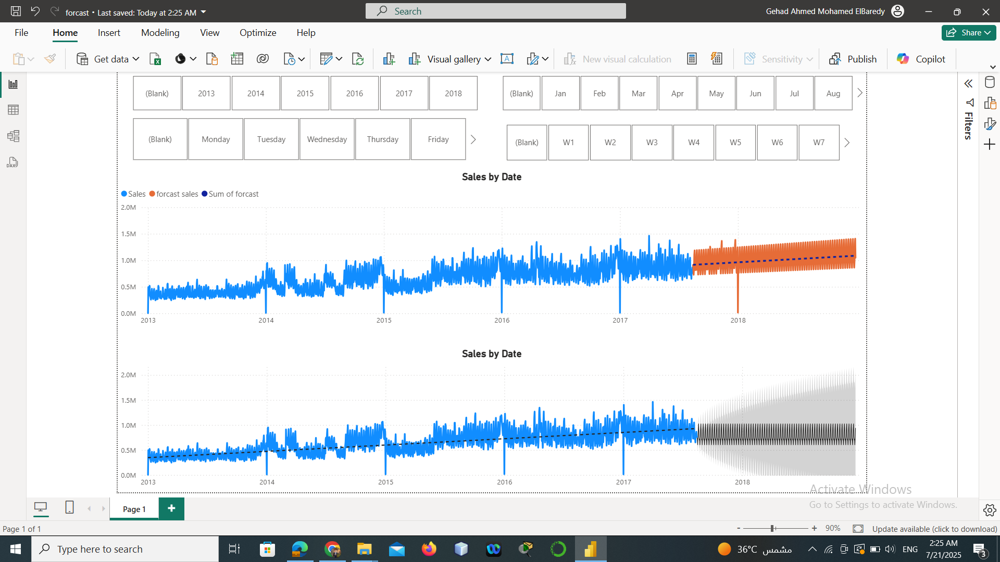

# 📈 Sales Forecasting in Power BI

This project demonstrates sales forecasting using both Power BI's built-in forecasting feature and manual linear regression modeling.

## 🔧 Tools Used
- Power BI
- DAX
- Excel (for pre-processing)
- Decomposition Tree visual
- Line Chart visualization

## 📊 Objective
To forecast sales for the upcoming year based on historical data and compare different forecasting techniques.

## ✅ Methods Implemented
1. **Built-in Forecast Tool** – to automatically project future sales trends.
2. **Manual Linear Regression** – slope and intercept were calculated to create a custom forecast line.
3. **Decomposition Tree** – used to analyze sales by multiple dimensions such as product, region, or time.
4. **Line Chart** – to compare actual vs. predicted values for better insight.

## 📷 Visuals

## 📁 File Structure
- `sales_forecasting.pbix` – The main Power BI file
- `sales_data.xlsx` – Source data (sample)
- `holiday_data.xlsx` – Source data (sample)
- `Screenshots/` – Visuals from the dashboard

---

Feel free to explore the PBIX file or reuse the forecasting logic in your own analysis!
